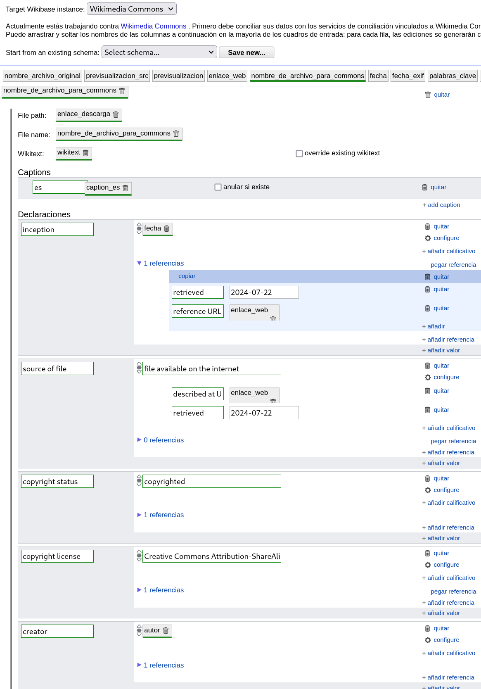

# Scrape Sala de Medios
## Cómo usar este script
1. Asegurate de tener python instalado en tu computadora
```
python3 --version
```
[Ver cómo instalar](https://www.python.org/downloads/)
2. Asegurate de tener instalados los módulos de python `requests`, `os`, `pandas` y `BeautifulSoup`. Podés instalarlos así:
```
python3 -m pip install requests
python3 -m pip install os
python3 -m pip install pandas
python3 -m pip install BeautifulSoup
```
o así
```
apt install python3-requests
apt install python3-os
apt install python3-pandas
apt install python3-BeautifulSoup
```
o buscá más información [acá](https://docs.python.org/3/installing/index.html)
3. Cloná este repositorio o descargá el archivo `sala_de_medios.py`
4. En `sala_de_medios.py` modificá las siguientes líneas según tus preferencias
```
#Comenzar en la página
START_AT_PAGE = 0
# Detenerse al llegar a este al archivo, por ejemplo: 20240716dicimouyplr61.jpg
STOP_AT_FILE = ""
#Detenerse al llegar a las N páginas
SCARPE_MAX_N_PAGES = 10
#Caption en español para las imágenes que no tienen título definido en la web de sala de medios
DEFAULT_CAPTION = "Fotografía de la Sala de Medios de la Intendencia de Montevideo"
```
5. Abrí la terminal y movete a la carpeta donde tenés el archivo `sala_de_medios.py`
6. Ejecutá el script con python
```
python3 sala_de_medios.py
```
6. Se genera un archivo `imagenes.csv` en la misma carpeta. Si el archivo ya existía, se le suman nuevas filas a este mismo archivo. En caso de que el archivo ya existiera, la ejecución del script se detiene al encontrar una foto que ya había sido procesada.
7. Crear un nuevo proyecto en Open Refine y abrir `imagenes.csv`.
8. Seleccionar instancia de Wikibase = Wikimedia Commons.
9. Reconciliar columna `nombre_de_archivo_para_commons`. Cotejar / Inicia cotejo.
10. Crear nuevos archivos para los archivos no entonctados. Cotejar / Acciones / Crear un nuevo elemento para cada celda
11. Crear el esquema de esta forma:

12. Cargar ediciones en Wikimedia Commons. Extensiones Wikidata / Cargar ediciones en Wikidata
## To do
- Esperar a que nos aprueben el dominio montevideo.gub.uy en [la lista de dominios permitidos](https://commons.wikimedia.org/wiki/MediaWiki_talk:Copyupload-allowed-domains)
- probar casos posibles:
-- quiero bajar todo y dividirme la tarea de subida entre 3 personas. importante que en este paso que OR reconozca en la reconciliación las fotos ya subidas.
-- quiero scrapear fotos más recientes
-- hace una semana scrapeé las últimas fotos. quiero escrapear las fotos más recientes
-- quiero scrapear un rango viejo de fotos
- agregar autor a los datos estructurados y/o wikitexto. Hay un bot que lo agrega a partir del EXIF? Es mejor usar el template Photograph o Information en el wikitext?
- arreglar headers del wikitexto 
- hay mejor información (título, palabras claves, descripción) que podamos extraer del EXIF? los extrae automáticamente un bot? Es mejor usar el template Photograph o Information en el wikitext?
- agregar categorías automáticamente a partir de ciertas palabras clave, o manualmente según rangos de fechas o páginas
- agregar caption en inglés
- NOTA / TAREA DESCARTADA: cómo scrapear las fotos del pasado. navegar fechas en lugar de navegar páginas? el 16/07 chequeé que las páginas llegan hasta la página 2551, marzo de 2024. Donde están las fotos de fechas anteriores? Están desordenadas? Esto se puede consultar con ellos.
